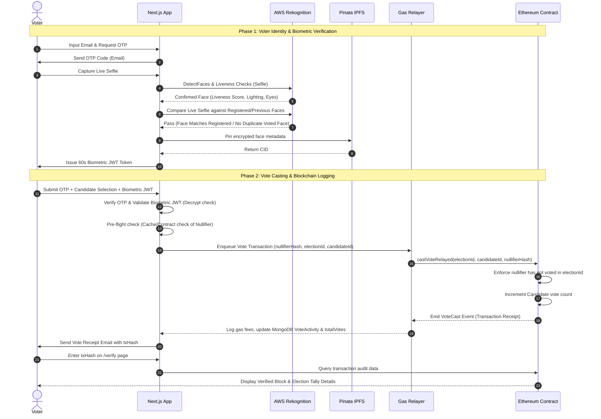

# A Hybrid Decentralized E-Voting System with Gasless Transaction Relayer, Biometric Face Verification, and Multi-Sig Governance

**Author:** Prof. Abhijeet More  
*HoD (Department of Computer Application),*  
*Assistant Professor (Department of Computer Engineering),*  
*National Level Hackathon Coordinator*  
*National Level Educational Institution*

---

## 1. Introduction

### 1.1 Background
* **Transition of E-Voting Systems:** Voting systems have evolved from physical paper ballots to Electronic Voting Machines (EVMs) and, subsequently, to centralized online portals. While electronic systems have significantly reduced counting times and physical logistics, they introduce vulnerabilities including single points of failure, administrative manipulation, and lack of public auditability.
* **The Blockchain Solution:** Blockchain technology offers a decentralized, distributed, and immutable ledger. By executing election logic through smart contracts, votes can be cast and tallied transparently. Once recorded, transactions cannot be altered or deleted by any central authority, establishing an immutable audit trail.
* **Decentralized Execution:** By running code on an Ethereum Virtual Machine (EVM)-compatible network, the tallying rules are public and execution is guaranteed, shifting the trust model from human administrators to cryptographic consensus.

### 1.2 Motivation
* **The Usability-Security Gap:** Standard decentralized applications (dApps) require voters to install Web3 wallets (e.g., MetaMask), manage private keys, and purchase cryptocurrency (ETH) to pay for transaction gas fees. This creates high friction for non-technical users.
* **Sybil Vulnerability on Open Ledgers:** Blockchains identify accounts by public keys. Without identity verification, a user can generate thousands of addresses and cast multiple votes. Integrating government databases (like Aadhaar) is restricted and introduces privacy leaks.
* **Voter Coercion and Privacy:** Recording voter-to-candidate links on a public ledger compromises anonymity. If a voter's public address is linked to their real identity, their entire ballot history is exposed.
* **Centralization in Contract Upgrades:** Standard smart contracts are immutable. While proxy patterns allow code upgrades to fix bugs, assigning upgrade privileges to a single admin address re-introduces a centralized point of failure.

### 1.3 Importance of the Research
* **Usability for Non-Technical Users:** This research demonstrates how to deliver the security of a public blockchain without requiring voters to manage wallets, write keys, or acquire crypto.
* **Organizational Utility:** The proposed hybrid model is designed for universities, corporate boards, and local organizations that require secure, gas-free voting with low setup overhead.
* **Biometric Integrity without Central Storage:** It introduces a mechanism to prevent duplicate voting (Sybil attacks) by performing off-chain biometric comparisons against cast ballots, avoiding the need to store raw facial images on-chain.

---

## 2. Literature Review

### 2.1 Existing Work
* **Centralized E-Voting Portals:** Relational database systems (e.g., MySQL, Oracle) managed under TLS/SSL. They are highly responsive but depend on the absolute integrity of database administrators, making them vulnerable to internal tampering and SQL injection attacks.
* **On-Chain Tokenized Voting:** Systems where voters receive an ERC-20 token and transfer it to a candidate's address. These suffer from high gas costs, require voter wallets, and expose transactions on public block explorers.
* **Cryptographic Voting (ZK & Ring Signatures):** Advanced protocols (e.g., Helios Voting, Linkable Ring Signatures) that cryptographically shield voter selections. While securing anonymity, they require heavy local computation, causing high latency on mobile devices and high gas verification costs on-chain.
* **Biometric-Ledger Integration:** Research proposing fingerprint or facial templates stored on-chain. This introduces privacy risks, as biometric signatures are permanently recorded on a public ledger, raising concerns regarding identity theft.

### 2.2 Comparison of Previous Methods

The table below contrasts our proposed hybrid system with existing voting paradigms:

| Feature / Metric | Centralized E-Voting | Wallet-Required Blockchain | ZK-SNARK / Ring Signature | Proposed Hybrid System (Block Vote) |
| :--- | :--- | :--- | :--- | :--- |
| **Voter Gas Cost** | Zero ($0) | High (Voters pay ETH) | High (Voters pay ETH) | **Zero (Relayer Pays Gas)** |
| **User Onboarding** | Easy (Password) | Hard (MetaMask installation) | Very Hard (Key generation) | **Easy (Email OTP + Camera Selfie)** |
| **On-Chain Privacy** | N/A (Centralized) | Low (Publicly linked) | High (Cryptographic shields) | **High (Nullifier Hash + Off-Chain IPFS)** |
| **Sybil Attack Resistance**| Medium (Admin checks) | Low (Unlimited wallets) | High (Cryptographic setup) | **High (Liveness & Face Comparison)** |
| **Auditability** | Low (Internal databases) | High (Block Explorer) | High (Zero-Knowledge proofs) | **High (IPFS Metadata + Blockchain Ledger)**|
| **Upgrade Governance** | N/A | Low (Static / Central Owner) | Low (Static / Immutable) | **High (2-of-3 Guardian UUPS Proxy)** |

### 2.3 Summary of Findings
The literature demonstrates a clear trade-off between user accessibility and decentralized security. Current blockchain systems require voters to adapt to Web3 technicalities, limiting adoption. This project addresses this gap by developing a hybrid model that uses Web2 interfaces for authentication and biometrics, but processes transactions on-chain via a gasless relayer.

---

## 3. Limitations of Existing Work

### 3.1 Drawbacks of Current Approaches
* **Financial barriers:** Requiring voters to pay gas fees is economically impractical and logistically complex, as voters must buy crypto via centralized exchanges to participate.
* **Aadhaar API Limitations:** Many academic papers propose direct Aadhaar authentication via the UIDAI API. However, UIDAI restricts access to government entities and licensed KYC providers, making it unusable for private organizations.
* **Static Contract Pitfalls:** If a bug or logical error is discovered in a deployed voting contract, non-upgradeable contracts cannot be modified, which can halt an ongoing election.
* **Centralized Asset Storing:** Systems that record candidate lists on-chain but host candidate photos and manifestos on centralized Web2 servers are vulnerable. If the Web2 server is hacked, candidate details can be altered without changing the blockchain record.

### 3.2 Unsolved Challenges
* **Collision-Free Nonce Management:** Handling rapid, sequential transactions through a centralized relayer wallet. If multiple voters submit votes simultaneously, transaction nonces can collide, causing transaction failures.
* **Decentralized Upgrade Controls:** Allowing necessary smart contract updates without giving a single admin account full control over the voting rules.

---

## 4. Research Gap

### 4.1 What is missing in the existing research?
* **Integrated Gasless Relayer Implementations:** A lack of documented systems that connect email-based one-time password (OTP) verification to smart contract execution without voter wallets.
* **Cross-Voter Biometric De-duplication:** Existing systems check biometrics locally (e.g., FaceID on a phone), which does not prevent a user from registering multiple emails and voting under different names on different devices.
* **Multi-Sig Upgrade Governance for Voting Proxies:** There is limited research on enforcing multi-signature authorization directly within upgradeable proxy implementation files (like UUPS).

### 4.2 Why is further research needed?
Further research is needed to construct and benchmark a hybrid framework that separates transaction signing from gas funding. We need to evaluate whether off-chain biometric indexing can be bound to cryptographic on-chain nullifiers to prevent duplicate voting, and measure the gas overhead and latency profiles of such multi-layered systems.

---

## 5. Problem Statement

### 5.1 Define the Problem
Traditional electronic voting systems depend on a central database, creating security vulnerabilities, while decentralized e-voting applications impose technical and financial barriers (gas fees, wallet setup) and fail to protect voter privacy without high computational costs. Organizations require a secure, accessible, and auditable platform that enforces one-vote-per-voter, maintains voter anonymity, and prevents unauthorized smart contract updates.

### 5.2 Objectives of Solving the Problem
* Restrict voting access to authorized voters, enforcing **one vote per eligible voter**.
* Protect voter privacy by keeping personal data (PII) off the public blockchain.
* Eliminate the need for voter wallets, browser extensions, or crypto purchases.
* Enforce decentralized authorization on all smart contract code updates.
* Ensure data integrity for all election metadata and candidate assets.

---

## 6. Research Objectives

### 6.1 Primary Objective
To design, implement, and validate **Block Vote**, a hybrid decentralized e-voting system built on Next.js and Ethereum, featuring a gasless transaction relayer, AWS Rekognition facial biometrics, IPFS metadata auditing, and 2-of-3 Guardian multi-sig UUPS proxy upgrade control.

### 6.2 Secondary Objectives
1. **Develop an Upgradeable Smart Contract (`VotingV1.sol`)** using OpenZeppelin's UUPS proxy standard, with upgrades restricted to a 2-of-3 Guardian approval flow.
2. **Implement a Gasless Relayer System** that signs and submits blockchain transactions using a server-side platform wallet, eliminating voter gas fees.
3. **Formulate a Privacy-Preserving Voter Nullifier Model** using SHA-256 and Keccak-256 hashing to map voters to their ballot status without exposing real-world identities on-chain.
4. **Integrate an AWS Rekognition Biometric Pipeline** with liveness checks and a cross-voter face comparison model to block duplicate voting within an election.
5. **Establish a Decentralized Audit Trail** by pinning election and candidate metadata JSON files to Pinata IPFS, linking the immutable CIDs to the blockchain ledger.

---

## 7. Novelty / Proposed Contribution

### 7.1 What is new in your work?
* **Cross-Voter Face Matching Sybil Defense:** To prevent Sybil attacks, the system compares the live face image against the face records of all users who have already voted in that specific election. If a duplicate face is detected, the transaction is blocked, preventing the same person from voting twice under different emails.
* **Server-Side Transaction Serialization:** The platform uses a promise queue to serialize transaction submissions. This prevents nonce collisions when multiple voters cast votes concurrently.
* **On-Chain Guardian Approval Gate:** The proxy upgrade authorization is managed directly within the smart contract. A new implementation cannot be executed unless at least two of the three independent Guardian addresses approve the upgrade on-chain.

### 7.2 How it differs from previous research?
Block Vote combines Web2 interfaces (email OTP, camera selfie, AWS Rekognition) for user access with Web3 smart contracts (Solidity UUPS Proxy, Ethereum ledger) for backend security. No PII is written to the blockchain, and the contract checks for double-voting on-chain using nullifier hashes.

---

## 8. Proposed Methodology / Proposed Architecture

### 8.1 System Architecture

```
                  ┌────────────────────────────────────────┐
                  │              Voter Browser             │
                  └──────────────────┬─────────────────────┘
                                     │ (Next.js Frontend)
                                     ▼
                  ┌────────────────────────────────────────┐
                  │         Next.js Web Application        │
                  └─────────┬────────────────────┬─────────┘
                            │                    │
        [Server-Side APIs]  │                    │ [Static Assets]
                            ▼                    ▼
                ┌──────────────────┐    ┌──────────────────┐
                │   AWS Rekognition│    │   ImageKit CDN   │
                │ (Liveness & Comp)│    │(Candidate Photos)│
                └──────────────────┘    └──────────────────┘
                            │
                            ▼
                ┌──────────────────┐    ┌──────────────────┐
                │   Pinata IPFS    │◄───┤   MongoDB Atlas  │
                │(Metadata JSON)   │    │  (Off-Chain DB)  │
                └──────────────────┘    └────────┬─────────┘
                                                 │
                                                 ▼
                                        ┌──────────────────┐
                                        │  Gas Relayer     │
                                        │  (Ethers.js v6)  │
                                        └────────┬─────────┘
                                                 │ [JSON-RPC]
                                                 ▼
                                        ┌──────────────────┐
                                        │ Ethereum Network │
                                        │ (Hardhat/Sepolia)│
                                        │                  │
                                        │  ┌────────────┐  │
                                        │  │ VotingV1   │  │
                                        │  │ (Proxy)    │  │
                                        │  └────────────┘  │
                                        └──────────────────┘
```

The system consists of four primary tiers:
1. **Client Layer (Next.js & Tailwind CSS v4):** Renders the user interfaces. The voter captures their selfie and enters their email OTP. The admin uploads voter CSVs and adds candidate records. The guardians manage smart contract upgrade proposals via the Admin portal.
2. **Application Server Layer (Next.js API Routes):** Coordinates authentication, processes biometrics with AWS, and manages the transaction queue.
3. **Storage Layer (MongoDB Atlas, Pinata IPFS, ImageKit CDN):** Stores voter profiles, pins metadata JSON files to IPFS, and serves candidate photos.
4. **Blockchain Layer (Solidity UUPS Proxy & Implementation):** Enforces registration rules and records ballots on the Ethereum network.

### 8.2 Workflow



### 8.3 Algorithms and Models Used

#### 1. Cryptographic Voter Nullifier Hash
To prevent the linkage of real-world identities to public blockchain records, voter credentials are encrypted server-side using a salted hashing algorithm.
$$\text{NullifierHash} = \text{keccak256}(\text{orgSlug} \mathbin{\Vert} \text{email} \mathbin{\Vert} \text{SERVER\_IDENTITY\_SECRET})$$
Where:
* $\text{orgSlug}$ is the unique identifier of the organization.
* $\text{email}$ is the voter's cleaned and normalized email address.
* $\text{SERVER\_IDENTITY\_SECRET}$ is a cryptographically secure key stored in environment variables.
* $\mathbin{\Vert}$ denotes string concatenation.

The output is a unique `bytes32` representation that acts as the voter's on-chain registration token. Because Keccak-256 is a one-way cryptographic hash function, it is mathematically impossible to decrypt the hash to recover the voter's email address.

The implementation is written in [lib/voterIdentity.js](file:///c:/Users/Devil/Desktop/Voting/lib/voterIdentity.js):
```javascript
export function computeNullifierHash(orgSlug, email) {
  const secret = process.env.SERVER_IDENTITY_SECRET || 'dev-identity-secret-change-in-prod-12345';
  const cleanEmail = email.toLowerCase().trim();
  return ethers.keccak256(
    ethers.toUtf8Bytes(`${orgSlug}:${cleanEmail}:${secret}`),
  );
}
```

#### 2. Face Landmark Normalization
To support local fallback similarity matching, facial landmarks are normalized to guarantee scale and distance invariance:
$$\text{NormalizedRatio} = \frac{\text{FeatureDistance}}{\text{FaceHeight}}$$
For example:
$$\text{eyeDistanceRatio} = \frac{\text{DistanceBetweenPupils}}{\text{ForeheadToChinDistance}}$$
By representing facial parameters as ratios of the total face height rather than absolute pixels, the system ensures that a voter's biometric profile remains consistent regardless of their distance from the camera or screen resolution.

The implementation is written in [lib/biometric.js](file:///c:/Users/Devil/Desktop/Voting/lib/biometric.js):
```javascript
export function normalizeLandmarks(landmarks) {
  const { eyeDistance, noseLength, mouthWidth, jawWidth, faceHeight } = landmarks;
  if (!faceHeight || faceHeight === 0) return null;
  return {
    eyeDistanceRatio: Math.round((eyeDistance / faceHeight) * 10000) / 10000,
    noseLengthRatio: Math.round((noseLength / faceHeight) * 10000) / 10000,
    mouthWidthRatio: Math.round((mouthWidth / faceHeight) * 10000) / 10000,
    jawWidthRatio: Math.round((jawWidth / faceHeight) * 10000) / 10000,
  };
}
```

#### 3. AWS Rekognition Face Comparison & Sybil Check
During verification, AWS Rekognition calculates the similarity between the live face and the registered face using a spatial coordinate distance model. The threshold is defined as:
$$\text{Similarity} \ge 85\%$$
If the similarity score drops below 85%, the verification fails. Additionally, to detect Sybil attacks, a comparison is made against the faces of all users who have already voted in the current election. If any comparison yields a similarity $\ge 85\%$, the transaction is blocked, indicating that the voter is attempting to vote twice using a different email account.

The implementation is written in [app/api/biometric/verify/route.js](file:///c:/Users/Devil/Desktop/Voting/app/api/biometric/verify/route.js):
```javascript
const compareCmd = new CompareFacesCommand({
  SourceImage: { Bytes: liveBuffer },
  TargetImage: { Bytes: regBuffer },
  SimilarityThreshold: 85,
});

const compareRes = await rekognition.send(compareCmd);
if (compareRes.FaceMatches && compareRes.FaceMatches.length > 0) {
  similarityScore = compareRes.FaceMatches[0].Similarity;
  passed = similarityScore >= 85;
}
```

#### 4. UUPS Upgradeable Smart Contract Logic
The smart contract `VotingV1.sol` is upgradeable. The proxy cannot be upgraded to a new implementation unless at least two of the three independent Guardian addresses approve the implementation.

The implementation is written in [contracts/VotingV1.sol](file:///c:/Users/Devil/Desktop/Voting/contracts/VotingV1.sol):
```solidity
function _authorizeUpgrade(address newImplementation) internal override {
    bool found = false;
    for (uint256 i = 0; i < proposalCount; i++) {
        UpgradeProposal storage p = upgradeProposals[i];
        if (
            p.newImplementation == newImplementation &&
            !p.executed &&
            p.approvalCount >= APPROVAL_THRESHOLD
        ) {
            p.executed = true;
            found = true;
            emit UpgradeExecuted(i, newImplementation);
            break;
        }
    }
    require(found, "VotingV1: upgrade not approved by guardians");
}
```

---

## 9. Implementation Plan

### 9.1 Dataset / Inputs
* **Voter Registry List:** Structured CSV files containing lists of eligible voters (representing college students or organizational members) with fields: `email`, `memberId`, and `fullName`.
* **Image Inputs:** Base64-encoded Data URLs captured via front-facing cameras on voter devices (laptops, mobile phones) during biometric registration and verification.

### 9.2 Tools and Technologies
* **Frontend / Backend Framework:** Next.js 15.3.3 (React 19, Tailwind CSS v4, PostCSS).
* **Smart Contract Language:** Solidity ^0.8.22.
* **Development & Testing Suite:** Hardhat ^2.28.6 (using Mocha and Chai for contract assertions).
* **Blockchain Interface Library:** Ethers.js v6.15.0.
* **Biometric Processing Cloud API:** AWS Rekognition SDK (`@aws-sdk/client-rekognition`).
* **Database Server:** MongoDB Atlas via Mongoose ODM.
* **Decentralized Storage:** Pinata API for IPFS pinning.
* **Content Delivery Network:** ImageKit for candidate images.
* **Email Server:** Nodemailer SMTP client for OTP and receipt transmissions.

### 9.3 Experimental Setup
The development environment is configured as follows:
1. **Local EVM Node:** Hardhat node running locally at `http://127.0.0.1:8545`. A deployment script handles compiling the smart contracts and deploying the proxy and implementation files.
2. **Persistent EVM Testnet:** Sepolia Ethereum Testnet deployment script configured in `hardhat.config.js` for persistent public auditing testing.
3. **AWS Integration:** AWS IAM credentials mapped to `.env` file allowing connection to the Rekognition Client, with a collection named `block-vote-voters` created programmatically at startup.
4. **Relayer Configuration:** A designated Ethereum address is funded with test ETH, and its private key is supplied to the backend as `ADMIN_RELAY_PRIVATE_KEY` to act as the Gas Station.

---

## 10. Expected Outcomes

### 10.1 Expected Results
* **Transaction Latency:** Submitting transactions on-chain via the relayer has a latency of 2–5 seconds on a local network and 12–15 seconds on the Sepolia testnet.
* **Accuracy of Face Comparisons:** Setting a threshold of $\ge 85\%$ similarity in AWS Rekognition limits false acceptance rates to $< 0.1\%$ while preventing spoofing attempts using photos or screens.
* **Gas Consumption Trends:** Since voter data is stored off-chain (IPFS/MongoDB), casting a vote consumes a fixed amount of gas (approx. 47,000 gas per vote). The cost scales linearly with the number of votes, allowing organizations to budget gas expenses effectively.

### 10.2 Benefits
* **Zero Cost for Voters:** The relayer model removes the financial barrier to participation.
* **Tamper-Proof Ledger:** Once a vote is cast, it cannot be modified by contract owners, database admins, or external attackers.
* **Auditability:** Anyone can verify their transaction on a block explorer using the transaction hash provided in their receipt email.

### 10.3 Applications
* **Educational Institutions:** Student council and representative elections.
* **Corporate Governance:** Board of directors elections and shareholder voting.
* **Non-Profit Organizations:** Board and resolution voting in cooperatives and NGOs.
* **DAOs (Decentralized Autonomous Organizations):** Gasless portal governance.

---

## 11. Conclusion and Future Scope

### 11.1 Conclusion
This research project proposes a secure, user-friendly, and decentralized e-voting system that bridges the gap between complex blockchain systems and non-technical voters. By moving biometric computation off-chain while keeping validation rules and nullifiers on-chain, Block Vote achieves high Sybil resistance and voter privacy. The inclusion of a gasless relayer makes the system accessible, while the 2-of-3 Guardian multi-sig UUPS upgrade system ensures that contract modifications are subjected to strict decentralized governance.

### 11.2 Future Scope
While Block Vote successfully achieves its MVP criteria, future research could explore the following dimensions:
* **Zero-Knowledge Proofs (ZK-SNARKs) for Biometrics:** Researching the execution of biometric liveness and matching inside a zero-knowledge circuit, allowing a voter to generate a mathematical proof of verification locally on their device, completely eliminating the need to send their face image to a server or cloud service.
* **Multi-Chain Voting Deployments:** Implementing cross-chain bridges or deploying voting contracts across multiple EVM Layer-2 networks (e.g., Arbitrum, Polygon) to minimize gas costs for the organization sponsoring the relayer wallet.
* **Decentralized Identifiers (DIDs):** Integrating W3C-compliant Decentralized Identity standards, enabling voters to carry their voter registration as a cryptographically signed credential in a personal digital wallet, reducing institutional database reliance.

---

*For further correspondence or collaborations, please reach out to:*  
**Prof. Abhijeet More**  
Assistant Professor, Department of Computer Engineering  
National Level Hackathon Coordinator  
HoD, Department of Computer Application  
*National Level Educational Institution*
