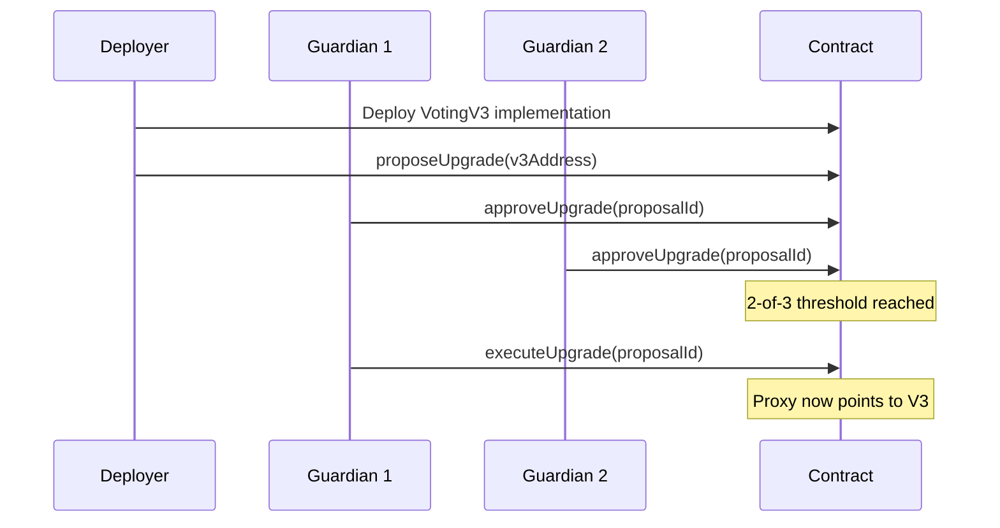

# BlockVote — Deployment Guide

> **Version**: 1.0  
> **Target Blockchain**: Sepolia (testnet)  
> **Current Hosting Plan**: AWS ($100 credits) → Vercel Free + Atlas Free (post-academic)

---

## Table of Contents

1. [Prerequisites](#prerequisites)
2. [Environment Variables](#environment-variables)
3. [Option A: AWS Deployment (Current)](#option-a-aws-deployment)
4. [Option B: Vercel + Atlas Free (Future)](#option-b-vercel--atlas-free)
5. [Option C: Docker Deployment (Any Cloud)](#option-c-docker-deployment)
6. [Option D: VPS Budget Deploy](#option-d-vps-budget-deploy)
7. [Blockchain Setup (Sepolia)](#blockchain-setup-sepolia)
8. [Contract Deployment & Upgrade](#contract-deployment--upgrade)
9. [Post-Deploy Checklist](#post-deploy-checklist)
10. [Monitoring & Operations](#monitoring--operations)

---

## Prerequisites

| Tool | Version | Purpose |
|------|---------|---------|
| Node.js | 20+ | Runtime |
| Yarn | 1.x | Package manager |
| Docker | 24+ | Containerization (optional) |
| AWS CLI | 2.x | AWS deployment (optional) |
| Hardhat | Built-in | Smart contract tooling |

External accounts needed:
- **MongoDB Atlas** — Free M0 cluster → [atlas.mongodb.com](https://cloud.mongodb.com)
- **Resend** — Email OTP delivery → [resend.com](https://resend.com)
- **ImageKit** — CDN for candidate photos → [imagekit.io](https://imagekit.io)
- **Pinata** — IPFS for election metadata → [pinata.cloud](https://pinata.cloud)
- **AWS** — Rekognition for face biometrics → [aws.amazon.com](https://aws.amazon.com)
- **Alchemy/Infura** — Sepolia RPC endpoint → [alchemy.com](https://www.alchemy.com)

---

## Environment Variables

Create a `.env` file with these values. **Never commit this file.**

```bash
# ── Database ──────────────────────────────────────────────────────
MONGODB_URI=mongodb+srv://<user>:<pass>@<cluster>.mongodb.net/blockvote

# ── Authentication ────────────────────────────────────────────────
JWT_SECRET=<random-64-char-hex>
NEXTAUTH_SECRET=<random-64-char-hex>
NEXTAUTH_URL=https://your-domain.com
GOOGLE_CLIENT_ID=<from-google-cloud-console>
GOOGLE_CLIENT_SECRET=<from-google-cloud-console>

# ── Cryptographic Secrets ─────────────────────────────────────────
SERVER_IDENTITY_SECRET=<random-64-char-hex>    # Used to compute voter nullifier hashes
SERVER_ENCRYPTION_KEY=<random-32-char-hex>     # AES encryption key

# ── Blockchain (Sepolia) ─────────────────────────────────────────
RPC_URL=https://eth-sepolia.g.alchemy.com/v2/<your-key>
NEXT_PUBLIC_RPC_URL=https://eth-sepolia.g.alchemy.com/v2/<your-key>
ADMIN_RELAY_PRIVATE_KEY=<relay-wallet-private-key>
ADMIN_RELAY_ADDRESS=<relay-wallet-address>
DEPLOYER_PRIVATE_KEY=<deployer-private-key>
NEXT_PUBLIC_CONTRACT_ADDRESS=<proxy-contract-address>
CONTRACT_IMPL_ADDRESS=<implementation-address>

# ── Guardian Multi-sig ────────────────────────────────────────────
GUARDIAN_1_PRIVATE_KEY=<guardian-1-key>
GUARDIAN_2_PRIVATE_KEY=<guardian-2-key>
GUARDIAN_3_PRIVATE_KEY=<guardian-3-key>
NEXT_PUBLIC_GUARDIAN_1=<guardian-1-address>
NEXT_PUBLIC_GUARDIAN_2=<guardian-2-address>
NEXT_PUBLIC_GUARDIAN_3=<guardian-3-address>

# ── Email (Resend) ────────────────────────────────────────────────
RESEND_API_KEY=re_<your-key>
RESEND_FROM=noreply@your-domain.com

# ── Media (ImageKit + Pinata) ─────────────────────────────────────
IMAGEKIT_PUBLIC_KEY=<key>
IMAGEKIT_PRIVATE_KEY=<key>
IMAGEKIT_URL_ENDPOINT=https://ik.imagekit.io/<your-id>
PINATA_API_KEY=<key>
PINATA_API_SECRET=<secret>
PINATA_JWT=<jwt>
PINATA_GATEWAY=https://gateway.pinata.cloud

# ── Biometrics (AWS Rekognition) ──────────────────────────────────
AWS_ACCESS_KEY_ID=<key>
AWS_SECRET_ACCESS_KEY=<secret>
AWS_REGION=ap-south-1

# ── OTP Config ────────────────────────────────────────────────────
OTP_MAX_ATTEMPTS=3
OTP_EXPIRY_MINUTES=5

# ── Admin ─────────────────────────────────────────────────────────
ADMIN_API_KEY=<random-api-key>
NEXT_PUBLIC_ADMIN_ORGS_API_KEY=<admin-orgs-key>
```

Generate secrets with:
```bash
node -e "console.log(require('crypto').randomBytes(32).toString('hex'))"
```

---

## Option A: AWS Deployment

Best for: Your current $100 credits, 100-500 users.

### Architecture

```
User → CloudFront CDN → EC2 (Next.js) → MongoDB Atlas
                                       → Sepolia RPC (Alchemy)
                                       → AWS Rekognition
```

### Step-by-Step

#### 1. Launch EC2 Instance

```bash
# Use t3.small (2 vCPU, 2GB RAM) — ~$15/month
# AMI: Amazon Linux 2023 or Ubuntu 22.04
# Security Group: Allow ports 22 (SSH), 80 (HTTP), 443 (HTTPS)
```

#### 2. Install Dependencies on EC2

```bash
# SSH into your instance
ssh -i your-key.pem ec2-user@<instance-ip>

# Install Node.js 20
curl -fsSL https://rpm.nodesource.com/setup_20.x | sudo bash -
sudo yum install -y nodejs git

# Install Yarn
sudo npm install -g yarn

# Install PM2 (process manager)
sudo npm install -g pm2

# Install Nginx (reverse proxy)
sudo yum install -y nginx
```

#### 3. Clone and Build

```bash
# Clone your repo
git clone https://github.com/<your-user>/blockvote.git
cd blockvote

# Install deps
yarn install --frozen-lockfile

# Create .env with all variables (see above)
nano .env

# Build production bundle
yarn build
```

#### 4. Configure Nginx

```nginx
# /etc/nginx/conf.d/blockvote.conf
server {
    listen 80;
    server_name your-domain.com;

    location / {
        proxy_pass http://127.0.0.1:3000;
        proxy_http_version 1.1;
        proxy_set_header Upgrade $http_upgrade;
        proxy_set_header Connection 'upgrade';
        proxy_set_header Host $host;
        proxy_set_header X-Real-IP $remote_addr;
        proxy_set_header X-Forwarded-For $proxy_add_x_forwarded_for;
        proxy_set_header X-Forwarded-Proto $scheme;
        proxy_cache_bypass $http_upgrade;
    }
}
```

```bash
sudo systemctl start nginx
sudo systemctl enable nginx
```

#### 5. SSL with Certbot

```bash
sudo yum install -y certbot python3-certbot-nginx
sudo certbot --nginx -d your-domain.com
```

#### 6. Start with PM2

```bash
# Start the production server
pm2 start yarn --name "blockvote" -- start

# Auto-restart on reboot
pm2 startup
pm2 save

# Monitor
pm2 logs blockvote
pm2 monit
```

#### 7. AWS Costs Breakdown

| Service | Monthly Cost | Notes |
|---------|-------------|-------|
| EC2 t3.small | ~$15 | 2 vCPU, 2GB RAM |
| MongoDB Atlas M0 | $0 | Free tier (512MB) |
| Alchemy Sepolia | $0 | Free tier |
| AWS Rekognition | ~$1-5 | $1/1000 face comparisons |
| Route 53 domain | $0.50 | DNS |
| Certbot SSL | $0 | Free Let's Encrypt |
| **TOTAL** | **~$17-21/month** | Lasts 5 months on $100 credits |

---

## Option B: Vercel + Atlas Free

Best for: Post-academic, zero cost, portfolio showcase.

### Step-by-Step

#### 1. Push to GitHub

```bash
git remote add origin https://github.com/<user>/blockvote.git
git push -u origin main
```

#### 2. Connect Vercel

1. Go to [vercel.com/new](https://vercel.com/new)
2. Import your GitHub repository
3. Framework: **Next.js** (auto-detected)
4. Add ALL environment variables from `.env` to Vercel project settings
5. Deploy

#### 3. MongoDB Atlas Free Tier

1. Go to [cloud.mongodb.com](https://cloud.mongodb.com)
2. Create free M0 cluster (AWS, Mumbai/us-east-1)
3. Create database user
4. Whitelist `0.0.0.0/0` (Vercel uses dynamic IPs)
5. Copy connection string → paste as `MONGODB_URI`

#### 4. Custom Domain (Optional)

```
Vercel Dashboard → Settings → Domains → Add your-domain.com
```

#### Vercel Limitations

| Limit | Free Tier | Impact |
|-------|-----------|--------|
| Serverless function timeout | 10s | May timeout on slow blockchain txs |
| Bandwidth | 100GB/month | Fine for 500 users |
| Builds | 6000 min/month | Fine |
| Function invocations | 100K/month | Fine for 500 voters |

---

## Option C: Docker Deployment

Works on any cloud that supports Docker (Railway, Render, DigitalOcean App Platform, AWS ECS, Fly.io).

### Build and Run

```bash
# Build the Docker image
docker build \
  --build-arg NEXT_PUBLIC_CONTRACT_ADDRESS=0x... \
  --build-arg NEXT_PUBLIC_RPC_URL=https://eth-sepolia.g.alchemy.com/v2/... \
  --build-arg NEXT_PUBLIC_GUARDIAN_1=0x... \
  --build-arg NEXT_PUBLIC_GUARDIAN_2=0x... \
  --build-arg NEXT_PUBLIC_GUARDIAN_3=0x... \
  -t blockvote .

# Run with env file
docker run -p 3000:3000 --env-file .env blockvote
```

### Full Stack (Docker Compose)

```bash
# Start everything (MongoDB + Hardhat + Next.js)
docker compose up -d

# Deploy the smart contract to the local chain
docker compose exec app npx hardhat run scripts/deployProxy.js --network localhost

# View logs
docker compose logs -f app
```

---

## Option D: VPS Budget Deploy

Cheapest option: Hetzner ($3.79/month) or DigitalOcean ($6/month).

```bash
# 1. Get a VPS (Ubuntu 22.04, 2GB RAM)
# 2. SSH in and run:

curl -fsSL https://get.docker.com | sh
sudo usermod -aG docker $USER

git clone https://github.com/<user>/blockvote.git
cd blockvote

# Create .env
nano .env

# Start everything
docker compose up -d

# Add SSL with Caddy (easier than Nginx + Certbot)
sudo apt install -y caddy
echo "your-domain.com { reverse_proxy localhost:3000 }" | sudo tee /etc/caddy/Caddyfile
sudo systemctl restart caddy
```

---

## Blockchain Setup (Sepolia)

### 1. Get Sepolia ETH

Free faucets:
- [sepoliafaucet.com](https://sepoliafaucet.com) — Alchemy (0.5 ETH/day)
- [faucets.chain.link](https://faucets.chain.link) — Chainlink (0.1 ETH)
- [cloud.google.com/application/web3/faucet](https://cloud.google.com/application/web3/faucet/ethereum/sepolia) — Google (0.05 ETH)

You need ETH in:
- **Deployer wallet** — for contract deployment (~0.05 ETH)
- **Relay wallet** — for gasless vote transactions (~0.5 ETH for 500 votes)

### 2. Get Alchemy RPC

1. Go to [alchemy.com/apps](https://dashboard.alchemy.com/apps)
2. Create app → Network: Ethereum Sepolia
3. Copy the HTTPS URL → use as `RPC_URL` and `NEXT_PUBLIC_RPC_URL`

### 3. Deploy Contract to Sepolia

```bash
# Deploy VotingV1 UUPS proxy
npx hardhat run scripts/deployProxy.js --network sepolia

# The script automatically updates .env with:
# - NEXT_PUBLIC_CONTRACT_ADDRESS (proxy)
# - CONTRACT_IMPL_ADDRESS
# - All guardian addresses
```

### 4. Upgrade to VotingV3

```bash
# 1. Deploy VotingV3 implementation
npx hardhat run scripts/deployV3Impl.js --network sepolia
# Note the implementation address

# 2. In the Guardian dashboard:
#    - Propose upgrade with the V3 implementation address
#    - Get 2 of 3 guardians to approve
#    - Execute the upgrade

# 3. Verify the upgrade
npx hardhat verify --network sepolia <implementation-address>
```

---

## Contract Deployment & Upgrade

### Local Development

```bash
# Terminal 1: Start local blockchain
yarn hardhat:node

# Terminal 2: Deploy proxy
yarn deploy:proxy

# Terminal 3: Start Next.js dev
yarn dev
```

### Upgrade Flow (V1 → V3)



---

## Post-Deploy Checklist

- [ ] **SSL/HTTPS** — Working (check `https://your-domain.com`)
- [ ] **MongoDB** — Connected (check `/api/preflight` returns JSON)
- [ ] **Blockchain** — Contract reachable (check `/api/relay/status`)
- [ ] **Email** — OTP delivery working (test voter login flow)
- [ ] **Biometrics** — Face scan working (test with camera)
- [ ] **Guardian multi-sig** — All 3 addresses configured
- [ ] **Rate limiting** — Active on `/api/auth/send-otp`
- [ ] **Security headers** — Check with [securityheaders.com](https://securityheaders.com)
- [ ] **PWA** — "Add to Home Screen" works on mobile
- [ ] **Environment** — No `NEXT_PUBLIC_*` secrets exposed (only public data)

---

## Monitoring & Operations

### PM2 Commands (AWS/VPS)

```bash
pm2 status           # Check if app is running
pm2 logs blockvote   # View logs
pm2 restart blockvote  # Restart
pm2 monit            # Real-time CPU/memory
```

### MongoDB Atlas Monitoring

- Atlas dashboard shows slow queries, connections, storage
- Set up alerts for: connection spikes, storage > 400MB (free tier limit)

### Relay Wallet Monitoring

```bash
# Check relay wallet balance (Sepolia)
node -e "
  const { ethers } = require('ethers');
  const p = new ethers.JsonRpcProvider(process.env.RPC_URL);
  p.getBalance(process.env.ADMIN_RELAY_ADDRESS).then(b =>
    console.log('Balance:', ethers.formatEther(b), 'ETH')
  );
"
```

Set up a cron job to alert when relay balance drops below 0.1 ETH:
```bash
# Crontab: check every 6 hours
0 */6 * * * cd /path/to/blockvote && node scripts/check-relay-balance.js
```

---

## Cost Summary

| Scenario | Monthly Cost | Capacity |
|----------|-------------|----------|
| AWS ($100 credits) | ~$17-21 | 500+ voters, biometrics, full features |
| Vercel Free + Atlas Free | $0 | 100-500 voters, 10s function timeout |
| DigitalOcean/Hetzner VPS | $4-12 | 1000+ voters, full control |
| Railway | $5-15 | Auto-scaling, easy deploy |

> **Recommended Path**: Start with AWS while you have credits → migrate to Vercel Free when credits expire → upgrade to Vercel Pro ($20/month) if you get real users.
